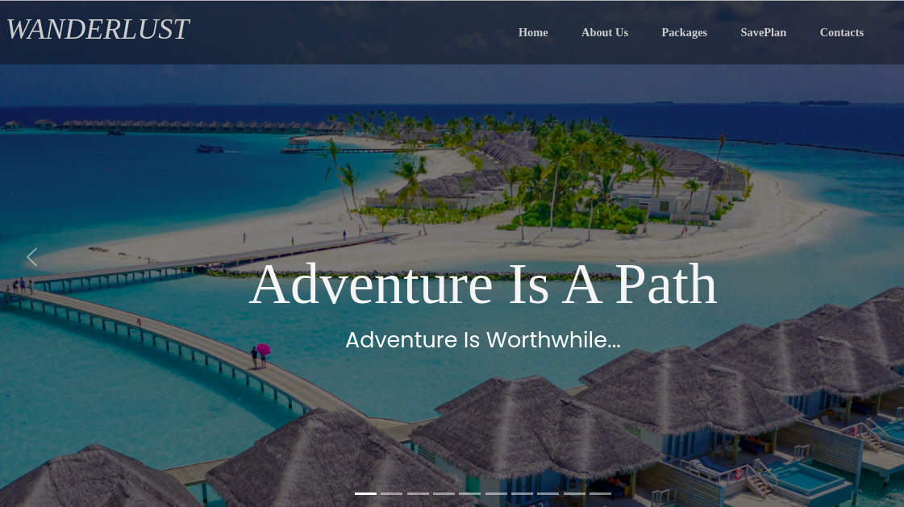

# Wanderlust Website

##### By 
Joseph Oderoh,
Jane Njihia,
Moureen Chepkoech,
Teresiah Gitundu

## Table of Content
+ [Description](#description)
+ [Installation Requirement](#Installation)
+ [Technology Used](#technology-used)
+ [Reference](#reference)
+ [Authors Info](#author-Info)

## Description
We're in an age where people are becoming more aware of their needs and desires with each rising day. They want to maximize on their travel and vacation experiences. We are a vacations company that opens up travel possibilities at affordable prices through installments.

## Installation

### Requirements
* Either a computer,phone,tablet or an Ipad
* An access to the Internet 

### Installation Process

## Technology Used
* HTML - which was used to build the structure for  the different pages.
* CSS- this was used to style the landing page and all the pages
* JQuery-which was used in adding interactive behavior to web pages.

## Reference
* MDN BOOTSTRAP
* STACK OVERFLOW
* W3SCHOOLS

## Authors Info
Email :  

[Joseph Oderoh](joseph.oderoh@student.moringaschool.com)
[Jane Njihia](jane.njihia@student.moringaschool.com)
[Moureen Chepkoech](moureen.chepkoech@student.moringaschool.com)
[Teresiah Gitundu](teresiah.gitundu@student.moringaschool.com)